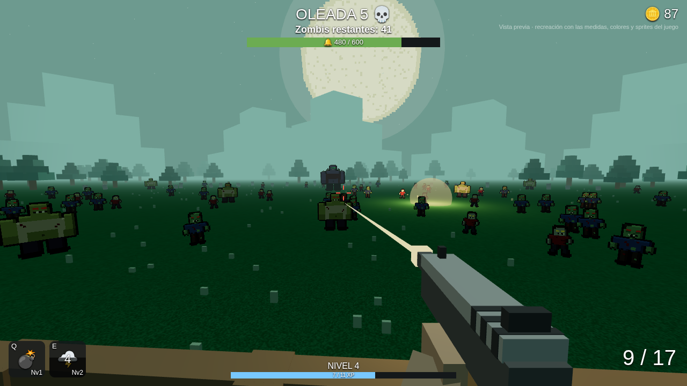

# Campana Maldita 🔔🧟

Juego de Roblox en primera persona, de bloques con texturas reales y en la Edad Media, con ciclo de día y noche: defiende la
campana de tu campamento, al borde de un acantilado sobre el mar, de hordas de muertos vivientes que llegan por dos caminos. Empiezas solo con un machete y una pistola; prepárate antes de cada partida
comprando armas, mejoras, poderes y trampas a los NPC del campamento.



_Vista previa: recreación con las medidas, colores y sprites del juego, no es captura de Roblox._

🎬 Video del pasto con viento y los zombis caminando: [`docs/capturas/texturado/video-viento-zombis.mp4`](docs/capturas/texturado/video-viento-zombis.mp4)
(recreación, no captura de Roblox).

Más vistas previas en [`docs/capturas/texturado/`](docs/capturas/texturado/) (bloques con texturas, el estilo actual),
[`docs/capturas/voxel/`](docs/capturas/voxel/) (pixel art 3D de colores planos),
[`docs/capturas/medieval/`](docs/capturas/medieval/) (noche medieval realista),
[`docs/capturas/otono/`](docs/capturas/otono/) (otoño) y [`docs/capturas/`](docs/capturas/) (versiones anteriores). El diseño completo está en [`docs/DISENO.md`](docs/DISENO.md).

## Qué tiene ya
- **Bloques con texturas reales**: todo es de cubos, pero con los materiales de Roblox (madera, piedra, ladrillo,
  hojas, tela, metal). El suelo es el terreno de Roblox con **pasto 3D que se mueve con el viento**, con ráfagas
  que lo hacen ondular. Los árboles, arbustos y estandartes también se mecen. El fuego es de cubitos que bailan,
  hay nubes de bloques y luciérnagas de cubitos, y los números grandes del HUD usan letra pixelada.
  (También está el estilo `"Voxel"`, de colores planos y baldosas.)
- **Zombis que se mueven como zombis**: cada uno camina distinto (largo del paso, ritmo, cabeza ladeada),
  algunos cojean y se hunden al pisar, el torso se balancea, la cabeza mira a los lados, los brazos suben y bajan,
  giran suave en las curvas, **salen de la tierra** arañando al aparecer, se echan hacia atrás cuando reciben
  un balazo y embisten al atacar. Los jefes dan pasos más lentos y pesados.
- **Ciclo de día y noche** (10 minutos por día): amanecer, mediodía, atardecer y noche con la luna enorme.
  Las velas y antorchas alumbran más de noche, y **de noche llegan más zombis** (30% más por segundo).
  Todos los jugadores ven la misma hora. Arriba a la derecha está el reloj.
- **Mapa medieval**: campanario al frente, campamento detrás (fogata, tiendas, empalizada) al borde de un
  **acantilado sobre el mar** (con mirador; si te caes, te lleva el mar). Alrededor: aldea con casas de
  entramado de madera, pozo, carreta, estandartes, **velas** y **antorchas** que parpadean, árboles secos y una luna enorme.
- **Dos caminos angostos** hacia la campana: el **camino del cementerio** (sale de una cripta, lo usan 3 de cada 4
  zombis) y el **camino de las ruinas** (sale del arco de un castillo en ruinas). Si un zombi te persigue y lo
  pierdes, vuelve a su camino.
- **Preparación antes de cada partida**: el único momento para comprar. La partida empieza cuando alguien
  **toca la campana** (mantener E) o cuando se acaba el tiempo. Durante las oleadas las tiendas están cerradas.
- **Empiezas con machete y pistola**. El machete no gasta balas; las armas de fuego tienen cargador y
  **reserva limitada**, y **cada zombi que eliminas te da balas** para el arma que tienes en la mano.
- **4 NPC** en el campamento (habla con **E**):
  - **Bruno, el Armero**: 6 armas (machete, pistola, escopeta, rifle, francotirador, ametralladora) y sus
    mejoras. **Cada mejora cambia el color del arma**: Bronce → Plata → Oro → Esmeralda → Legendaria.
  - **Morgana, la Bruja**: poderes (granada, rayo en cadena, campanazo) y sus mejoras.
  - **Don Ramiro, el Veterano**: gasta tus puntos de mejora y aprende talentos.
  - **Gustavo, el Intendente**: **cartuchera** (más balas máximas y más balas al empezar) y **trampas**:
    hasta 8 **minas** sobre los caminos y 2 **rejas** (una por camino) que los detienen hasta que las rompen.
- **Zombis que te persiguen** si te acercas, y vuelven a atacar la campana si te alejas. Tienes vida y reapareces.
- **5 tipos de zombi** de dibujo animado (piel verde, ojos enormes, boca abierta, camisa rota y jean): Zombi,
  Corredor, Zombi con cono, Caballero zombi y Bruto.
- **Jefes 6 veces más grandes** cada 5 oleadas, con su barra de vida arriba:
  - 🤢 **Zombi Gordo**: lento y resistente; al morir revienta y suelta 8 zombis.
  - 👑 **Rey Zombi**: corona, capa y mucha vida.
  - 🐉 **Dragón Zombi**: vuela directo a la campana por encima de rejas y minas y le escupe fuego verde.
- **Muerte pixelada**: el zombi se pone blanco, la cabeza sale volando, el cuerpo se desarma y revienta en
  cubitos que rebotan y se achican, y queda una mancha en el suelo.
- **Nivel de cuenta**: al terminar la partida ganas XP. Cada nivel da 1 punto de mejora (daño, vida, velocidad,
  recarga, cadencia, munición, crítico, botín, poder) y cada 5 niveles un **talento** (apuntar, correr,
  regeneración, vampiro, doble salto, esquivar, último aliento, balas explosivas, codicia, reparador).
- **Todo se guarda** (monedas, nivel, armas, poderes, talentos) con DataStore.
- Cooperativo, y funciona en celular.

## Cómo probarlo en tu Mac

1. **Instala Rokit y Rojo** (solo la primera vez):
   ```bash
   curl -sSf https://raw.githubusercontent.com/rojo-rbx/rokit/main/scripts/install.sh | bash
   cd ruta/a/este/repo
   rokit install
   rojo plugin install
   ```
2. **Arranca Rojo**: `rojo serve`
3. En Roblox Studio abre un **Baseplate** nuevo → **Plugins** → **Rojo** → **Connect** → **Play**.
4. **Para que se guarde el progreso en Studio**: Home → Game Settings → Security →
   **Enable Studio Access to API Services** (el juego tiene que estar publicado).

Los gráficos ya vienen configurados en `default.project.json`: iluminación **Future**, pasto 3D
(`Terrain.Decoration`) y **StreamingEnabled**. No tienes que tocar nada en Studio.

## Gráficos y rendimiento
- **Estilo**: `Config.ArtStyle` = `"Texturado"` (bloques con texturas y pasto con viento, por defecto),
  `"Voxel"` (pixel art 3D de colores planos y baldosas) o `"Realista"` (formas redondas, desenfoque y fuego
  de partículas).
- **Viento**: `Config.Wind` (dirección, fuerza y ráfagas).
- **Día y noche**: `Config.DayCycle` (duración del día, hora de inicio, cuántos zombis más de noche;
  `Enabled = false` para dejarlo siempre de noche).
- **Ambiente**: `Config.Theme` = `"Medieval"` (aldea medieval con día y noche, por defecto), `"Otono"`
  (atardecer de otoño), `"Verde"`, `"Morado"` o `"Ambar"` (noches fijas).
- **Zombis**: `Config.ZombieStyle` = `"3D"` (por defecto) o `"Pixel"` (sprites 2D, aún más ligero; los jefes
  siempre son 3D).
- **Caminos**: los puntos de cada camino están en `Config.Paths` (y cuántos zombis van por cada uno en `Weight`).
- **Optimización**:
  - **StreamingEnabled**: cada jugador carga solo lo que tiene cerca; las montañas del fondo siempre se ven.
  - Los avisos de zombis (nacer, recibir daño, morir) se juntan en **un mensaje por fotograma**
    en vez de uno por zombi.
  - Los zombis que están detrás de ti no se dibujan, y los lejanos no se animan (`Config.Graphics`).
  - La muerte en cubitos tiene un tope de 260 cubitos a la vez, y los zombis muy lejanos mueren sin efecto.
  - El molino, las partículas y el parpadeo de velas y antorchas corren solo en cada cliente.
  - En **calidad gráfica baja o celular** se apagan el desenfoque, los rayos de sol, las partículas y el parpadeo.

## Luna y sol pixelados (opcional)

`tools/make_sky.py` genera `assets/sky/Moon.png` y `assets/sky/Sun.png`. Súbelos como los sprites
(Asset Manager → Bulk Import), copia sus ids y pégalos en `Config.SkyTextures`. Si no los subes, Roblox usa su
luna y su sol normales (las fotos de vista previa muestran los pixelados).

## Subir los sprites de los zombis (solo estilo `"Pixel"`)

Con `ZombieStyle = "3D"` no hace falta. En estilo `"Pixel"`, mientras no subas los sprites,
los zombis se ven como muñecos de bloques.

1. En Studio: **View → Asset Manager → Bulk Import** y elige los 5 PNG de `assets/sprites/`
   (Walker, Runner, Cone, Knight y Brute, con el estilo de dibujo animado).
2. Clic derecho en cada imagen → **Copy Asset ID**.
3. Pégalo en `src/shared/Config.luau`, en el campo `Sprite` del enemigo, por ejemplo:
   ```lua
   Sprite = "rbxassetid://1234567890",
   ```

Para cambiar o crear sprites, edita `tools/make_sprites.py` y ejecuta `python3 tools/make_sprites.py`
(necesita `pip install pillow`).

## Controles
| Acción | PC | Celular |
|---|---|---|
| Disparar | Clic izquierdo (mantener) | Botón 🔫 |
| Recargar | R | Botón 🔄 |
| Cambiar de arma | 1 - 6 (1 = machete) | Botón 🔁 |
| Hablar con NPC / empezar partida / reparar campana | E | Tocar el aviso |
| Poderes | G granada · Q rayo · F campanazo | Botones abajo a la izquierda |
| Apuntar (talento Puntería) | Clic derecho | Botón 🔭 |
| Correr (talento Correr) | Shift | Botón 🏃 |
| Esquivar (talento Esquivar) | C | Botón 💨 |

## Estructura

```
src/
  shared/                   → ReplicatedStorage.Shared (servidor y cliente)
    Config.luau             ← TODOS los números del juego (enemigos, jefes, caminos, armas, poderes, mejoras, talentos)
    Paths.luau              ← geometría de los caminos de los zombis
    DayCycle.luau           ← hora del día, paletas de luz y "es de noche"
    Progression.luau        ← perfil, nivel de cuenta y cálculo de estadísticas
    EnemyMath.luau          ← movimiento de los zombis (línea quebrada por los caminos)
    Remotes.luau            ← comunicación servidor ↔ cliente
  server/                   → ServerScriptService.Server
    MapBuilder.luau         ← terreno, campanario, bosque, molino, montañas, luz y bruma
    MedievalBuilder.luau    ← caminos, cementerio con cripta, ruinas, casas, pozo, velas y antorchas
    VoxelBuilder.luau       ← suelo de baldosas, acantilado y mar en pixel art 3D
    CampBuilder.luau        ← fogata, tiendas, empalizada, mirador, puestos y NPC
    Props.luau              ← piezas del mapa (faroles, antorchas, velas, estandartes, cajas, letreros…)
    DataService.luau        ← guardado del perfil (DataStore)
    ShopService.luau        ← compras de los 4 NPC (solo en la preparación)
    MatchService.luau       ← estadísticas de la partida y XP final
    EnemyService.luau       ← zombis (caminos, persecución, jefes, daño, empuje)
    WaveService.luau        ← oleadas y orden de los jefes
    CombatService.luau      ← valida disparos y munición (anti-trampas)
    PowerService.luau       ← granada, rayo y campanazo
    PlayerService.luau      ← vida, velocidad, talentos del servidor y caída al mar
    TrapService.luau        ← minas y rejas
    GameState.luau          ← vida de la campana y estado
  client/                   → StarterPlayerScripts.Client
    Profile.luau            ← copia local del perfil
    ShopUI.luau             ← ventanas de los NPC
    MatchSummary.luau       ← pantalla de fin de partida
    Hud.luau / Notify.luau  ← interfaz y avisos
    WeaponController.luau   ← disparo, munición, cambio de arma, apuntar
    MovementController.luau ← correr, doble salto, esquivar
    PowerController.luau    ← poderes y sus efectos
    Viewmodel.luau          ← armas y manos en primera persona
    EnemyRenderer.luau      ← dibuja y anima los zombis (3D o pixel, con recorte por distancia)
    ZombieModels.luau       ← piezas de cada zombi, del Gordo, del Rey y del Dragón
    DeathFx.luau            ← muerte en cubitos
    WorldFx.luau            ← molino, viento (ráfagas y cosas que se mecen), fuego y calidad gráfica
    SkyFx.luau              ← ciclo de día y noche, nubes y luciérnagas de cubitos
    ZombieAnimator.luau     ← manera de caminar de cada zombi, cojera, salir de la tierra, golpes y embestidas
  character/Health.server.luau ← quita la regeneración automática de Roblox
assets/sprites/             ← PNG de los zombis
tools/make_sprites.py       ← generador de los sprites
tools/make_sky.py           ← generador de la luna y el sol pixelados
```

## Balance rápido
Todo está en `src/shared/Config.luau`:
- ¿Muy fácil? Sube `Waves.CountGrowth` o la `Speed` de los enemigos.
- ¿Los zombis pegan muy fuerte? Baja `PlayerDamage` de cada enemigo.
- ¿Subes de nivel muy lento? Baja `Progression.XpBase` o sube `XpPerKill`.
- ¿Las armas son muy caras? Cambia `Price` en `Config.Weapons`.
- ¿Te quedas sin balas muy rápido? Sube `AmmoPerKill` o `StartReserve` del arma.
- ¿La preparación es muy larga? Cambia `Match.LobbyTime`.
- ¿Otro ambiente? Cambia `Theme` a `"Otono"`, `"Verde"`, `"Morado"` o `"Ambar"`.
- ¿Los jefes son muy duros? Baja su `MaxHealth` o sube `Waves.BossEvery`.
- ¿Más zombis por el segundo camino? Sube el `Weight` de `Config.Paths.Side`.
- ¿La noche es muy difícil? Baja `DayCycle.NightSpawnMultiplier` (1 = igual que de día).
- ¿Días más largos? Sube `DayCycle.Length` (en segundos).
